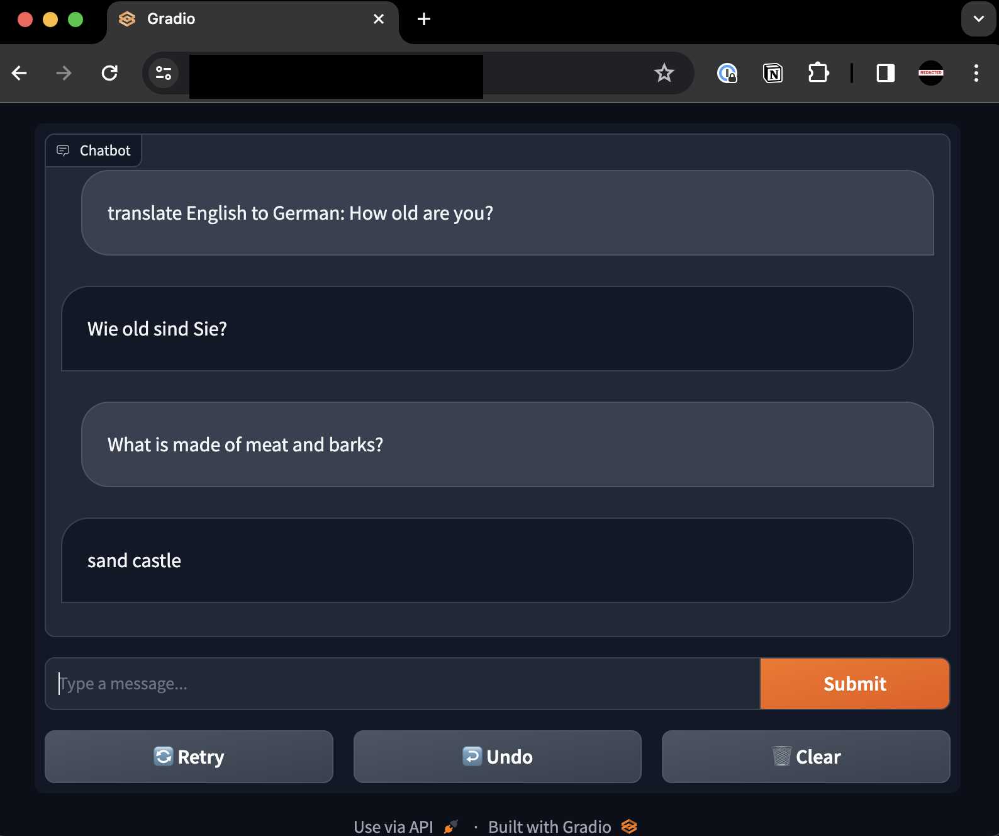

# Google T5-Flan-Base Chatbot on Gradio

This is an interface using Gradio to iteract with Google T5-Flan-Base.  I wrote this to learn Gradio and wanted to share for 💪 others.  

[](https://opensource.org/licenses/MIT) 

---

## Table of Contents

- [Installation](#installation)
- [Usage](#usage)
- [Acknowledgements](#acknowledgements)

---

## Installation

This application is simple to install. You need python installed, pytorch, and an Nvidia GPU to use this interface. [Anaconda](https://www.anaconda.com/download) is a great distribution.

I've found that using WSL and pip is now my favorite way to run these types of things.


```bash
# Example:
git clone https://github.com/RamboRogers/google-t5-flan.git
cd google-t5-flan
pip install -r requirements.txt
```
## Usage

Just launch the application using python.  You may want to activate conda.

```bash
# Example:
python app.py
```

Open up your browser to [http://127.0.0.1:7860/](http://127.0.0.1:7860/) and start creating!  

*Note: This AI doesn't seem very advanced 😆.*



## Acknowledgements

[Gradio](https://www.gradio.app/) is amazing, and so is [Huggingface](https://huggingface.co/)!

[matthewrogers.org](https://matthewrogers.org)
